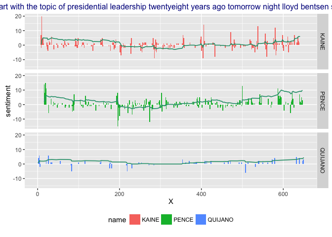

# SENTIMENT OF OCT 2016 VP DEBATE SPEECH
WW44SS  
Oct 6, 2016  


###SUMMARY
Can we learn anything about a debate and it's outcome from a "sentiment" analysis? I adapt methods recently hightlight by David Robison and Julia Silge to create a kind of "movie" version of the sentiment analysis, with text of especially "strong" sentiment highlighted.

###DATA SOURCES AND METHODS
The text of the debate are downloaded from the [UCSB Presidency Project](http://www.presidency.ucsb.edu/debates.php). Transcripts were pasted into Apple Pages and stored as unformatted .txt files.  

These are lighlyt cleaned (removing punctuation and annotation) by a utility program, catagorized by speaker, and stored as a .csv file which is loaded here for analysis. 


```r
## this is an identity helper-function for debug
idem <-function(x){x}
```


```r
    library(dplyr)
    library(animation)
    library(ggplot2)
    library(tidytext)
```


```r
    ## 
    ## .txt file detection
    

    directory <- "/Users/winstonsaunders/Documents/oct_2016_vp_debate/"
    file.list <- list.files(directory)
```


```r
    ## search for and read lightly cleaned debate text .csv
    data.file <- file.list[grepl("_cleaned", file.list)]
    debate_text <- read.csv(paste0(directory, data.file), stringsAsFactors = FALSE) %>% as_data_frame
```

We now begin processing by taking the text, unnesting the sentences, and removing stop words.


```r
    ## create tidy df of debate words
    ## add netural non-"stop" word to each
    debate_words <- debate_text %>%
        unnest_tokens(word, text) %>%
        filter(!word %in% gsub("'", "" , stop_words$word)) %>% 
        idem
```

WE create a "sentiment dictionary" from the information stored in the `tidytext` package and use a `left_join` to assicate words with the sentiment values.


```r
    ## compute sentiment dictionary
    word_sentiment_dict <- sentiments %>%
        filter(lexicon == "AFINN") %>%
        select(word, sentiment = score) %>%
        idem
    
    ## get sentiment of individual words by joining data with dictionary
    word_sentiment_df <- debate_words %>%
        left_join(word_sentiment_dict, by = "word") %>%
        mutate(sentiment = ifelse(is.na(sentiment), 0, sentiment)) %>%
        mutate(sentiment = as.numeric(sentiment)) %>%
        idem
```

To look at the trend of the sentiment, I create an exponentially damped cummulative sum function to apply to the data. 


```r
    decay_sum <- function(x, decay_rate = 0.1421041) {
        ## EXPONENTIALLY DAMPED CUMMULIATVE SUM
        ## input:   x (a vector of length >1)
        ##          decay_rate (exponential damping factor)
        ## output:  decay_sum (a vector with the cummulatve sum)
        
        ## create output vector
        if (length(x) > 1) decay_sum <- 1.*(1:length(x))
        
        ## initialize
        decay_sum[1] <- x[1]*1.
    
        ## compute the sum
        if (length(x) > 1) {
            for (i in 2:length(x)){
                decay_sum[i] <- x[i] + exp(-1.*decay_rate) * decay_sum[i-1]
            }
        }
        
        return(decay_sum)
    }
```

We compute the sum of the sentiment and the cummulative sum.


```r
    ## compute sentiment of debate responses by regrouping and compute means and cumsums
    sentiment_df <- word_sentiment_df %>%
        group_by(X, name) %>%
        summarize(sentiment = sum(sentiment)) %>%
        group_by(name) %>%
        mutate(cumm_sent = decay_sum(sentiment, decay_rate = 0.02)) %>%
        idem
```

The final step is to pull it all together to create a plot data frame. 


```r
    ## create data_frame for plotting. Since some X have no entry, need to fix those
    plot_df <- sentiment_df %>% left_join(debate_text, by = c("X", "name")) %>%
        select("X" = X, "name" = name, sentiment, cumm_sent, text) %>%
        group_by(name) %>%
        idem
```
From here I just use the `animation` package functions to create the gif.


```r
    saveGIF({
    for (i in gif_steps) {
        print( 
           
            ggplot(plot_df%>% filter(X <= i), aes(x = X, y = sentiment, fill = name)) +
                geom_bar(stat = 'identity', alpha = 1., width = 2) +
                geom_line(aes(x=X, y = 10*cumm_sent/max(abs(plot_df$cumm_sent))), size = .6, color = "#2B9E7A") +
                xlim(range(plot_df$X)) +
                ylim(range(plot_df$sentiment)) +
                ggtitle(paste0(plot_df$name[plot_df$X == i], ": ", gsub("[a-z]+$", "", substr(plot_df$text[plot_df$X == i], 1, 140)) ) ) +
                facet_grid(name~.) +
                theme(plot.title = element_text(size = 12, colour = "darkblue"), legend.position = "bottom")
        ) 
        
          
    }
    }, interval = .5, movie.name = paste0(directory,"sentiment_animation.gif"), ani.width = 800, ani.height = 400)
```

 

Here is a single image


```r
i <- gif_steps[5]

ggplot(plot_df , aes(x = X, y = sentiment, fill = name)) + #%>% filter(X <= i), aes(x = X, y = sentiment, fill = name)) +
    geom_bar(stat = 'identity', alpha = 1.) +
    geom_line(aes(x=X, y = 10*cumm_sent/max(abs(plot_df$cumm_sent))), size = .6, color = "#2B9E7A") +
    xlim(range(plot_df$X)) +
    ylim(range(plot_df$sentiment)) +
    ggtitle(paste0(plot_df$name[plot_df$X == i], ": ", gsub("[a-z]+$", "", substr(plot_df$text[plot_df$X == i], 1, 140)) ) ) +
    facet_grid(name~.) +
    theme(plot.title = element_text(size = 12, colour = "darkblue"), legend.position = "bottom")
```

```
## Warning: Stacking not well defined when ymin != 0
```

<!-- -->

